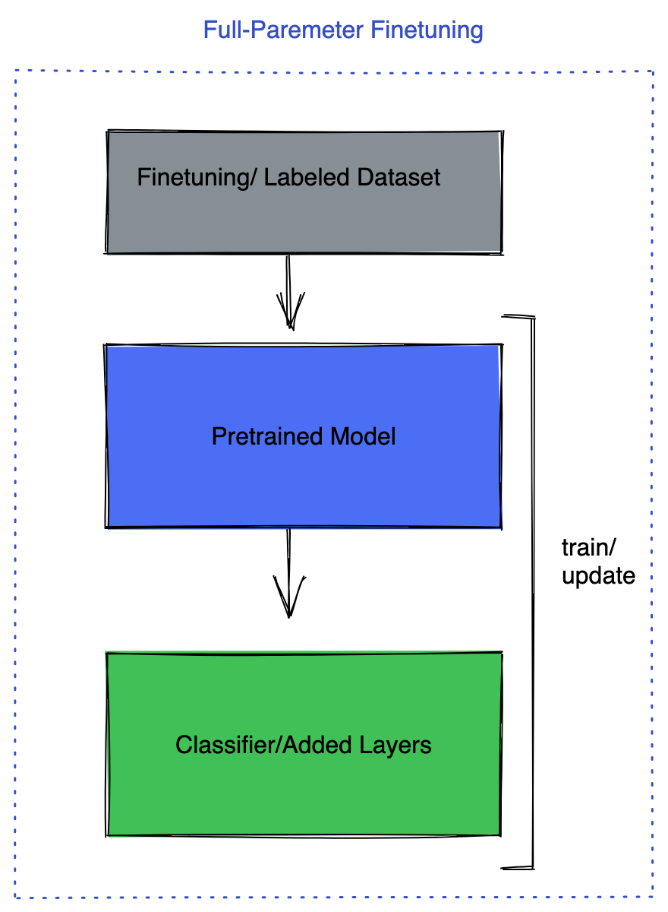

## Quick Start

**For more details checkout our following examples:**

* [single GPU](./examples/single_gpu.md)
* [multi-GPU](./examples/mutli_gpu.md) 


Want to test quickly? run the follwing on one consumer grade GPU, A10, T4, V100, etc.

**Note** in all command below to change the dataset please pass `dataset` arg, current options for dataset are `grammar_dataset`, `alpaca_dataset`, and `cnn_dailymail_dataset`. A description of the datasets and how to add custom datasets can be found in [Dataset.md](./docs/Dataset.md).

**One GPU** :

Here we make use of Parameter Efficient Methods (PEFT) as described in the next section. To run the command below make sure to pass the `peft_method` arg which can be set to `lora`, `llama_adapter`, `prefix`.

**Note** if you are running on a machine with multiple GPUs please make sure to only make one of them visible using `export CUDA_VISIBLE_DEVICES=GPU:id`

**To save the model make sure you set [save_model](configs/training.py). Check other training setting also in [train config](configs/training.py) and respectively for others in config folder**

```bash
pip install -r requirements.txt
python llama_finetuning.py  --use_peft --peft_method lora --quantization 

```


**Multiple GPUs One Node**:

Here we use FSDP as discussed in the next section which can be used along with PEFT methods. To make use of PEFT methods with FSDP make sure to pass `use_peft` amd `peft_method` args along with `enable_fsdp`.

```bash

pip install -r requirements.txt
torchrun --nnodes 1 --nproc_per_node 4  llama_finetuning.py --enable_fsdp --use_peft --peft_method lora

```

If interested to run full parameter finetuning without making use of PEFT methods. Make sure to change the `nproc_per_node` to your available GPUs.

```bash

pip install -r requirements.txt
torchrun --nnodes 1 --nproc_per_node 4  llama_finetuning.py --enable_fsdp 

```

**Multi GPU Multi Node**:

```bash

pip install -r requirements.txt
sbatch multi_node.slurm 
# Change the num nodes and GPU per nodes in the script before running.

```

**Inference**:

Depending on the type of fine tuning performed during training the [inference script](inference.py) takes different arguements.
For a fine tuning of all model parameters the output dir of the training has to be given as --model_name argument.
In case a parameter efficient method like lora the base model has to be given as --model_name and the output dir of the training has to be given as --peft_model argument.
Additionally, a prompt for the model in form of a text file has to be provided. The prompt file can either be piped through standard input or given as --prompt_file parameter.

Examples:
 ```bash
# Full fine tuning of all parameters
cat <test_prompt_file> | python inference/inference.py --model_name <training_config.output_dir>
# PEFT method
cat <test_prompt_file> | python inference/inference.py --model_name <training_config.model_name> --peft_model <training_config.output_dir>
# prompt as parameter
python inference/inference.py --model_name <training_config.output_dir> --prompt_file <test_prompt_file>
 ``` 
The inference folder contains test prompts for three of the integrated datasets:
```
inference/cnn_dailymail_prompt.txt
...
```

Want to read more on our Finetuning strategies here, keep reading.


## LLM fine_tuning

Here we discuss finetuning LLaMA with couple of different recipes. We will cover two scenarios here:


## 1. **Parameter Efficient Model Finetuning** 
 This help to make the fine-tuning process much more affordable even on 1 consumer grade GPU. These methods enable us to keep the whole model frozen and just add a tiny learnable parameters/ layers into the model, so technically we just train a very tiny portion of the parameters.The most famous method in this category in [LORA](https://arxiv.org/pdf/2106.09685.pdf), LLaMA Adapter and Prefix-tuning. 


These methods will address three aspects


- **Cost of full finetuning** – these methods only train a small set of extra parameters instead of the full model, this makes it possible to run these on consumer GPUs.

- **Cost of deployment** – for each fine-tuned downstream model we need to deploy a separate model; however using these methods only a small set of parameters few MB instead of several GBs of pretrained model can do the job. In this case for each task we only add these extra parameters on the top of the pretrained model,so pretrained models can be assumed as backbone and these parameters as heads for the model on different tasks.

- **Catastrophic forgetting** — these methods also help with forgetting of the first task that can happen in fine-tunings.

HF [PEFT](https://github.com/huggingface/peft) library provide an easy way of using these methods which we make use of it here. Please read more [here](https://huggingface.co/blog/peft). 


## 2. **Full/ Partial Parameter Finetuning**

Full parameter finetuning has its own advantages, in this method there are multiple strategies that can help,

1-  Keep the pretrained model frozen and only finetune the task head for example the classifier model.


2- Keep the pretrained model frozen and add few fully connected layers on the top.


3- Finetuning on all the layers

Also, you can keep most of the layers frozen and only finetune few layer, there are many different techniques here how to choose, freeze/unfreeze layers based on different criteria.

<div style="display: flex;">
    
    
    
</div>


In this scneario depending on the model size, you might need to go beyond one GPU, specially if your model does not fit into one GPU for training. In this case discussing LLaMA 7B parameter, it wont fit into one gpu. The way you want to think about it is, you would need enough GPU memory to keep model parameters, gradients and optimizer states. Where each of these depending on the precision you are training can take up multiple times of your parameter count x precision( depending if its fp32/ 4bytes, fp16/2 bytes/ bf16/2 bytes). As an example if you are using AdamW optimizer it keeps 2 paramters for each of your parameters that in many cases they are kept in fp32. This implies that depending on how many layers you are training/ unfreezing your GPU memory can grow beyond one GPU. 

**FSDP (FUlly Sharded Data Parallel)**


Pytorch for training models that does not fit into one GPU has the FSDP package. FSDP let you train a much larger model with same amount of resources. Prior to FSDP you might be familiar with DDP (Distirbuted Data Parallel) where each GPU was holding a full replica of the model and would only shard the data, at the end of backward pass it would sync up the gradinets. 

FSDP extends this idea, not only sharding the data but also model parameters, gradinets and optimizer states. This mean each GPU will only keep one shard of the model. This will result in huge memory savings that enable us to fit a much larger model into the same number of GPU. As an example in DDP the most you could fit into a GPU with 16GB memory is a model around 700M parameters. So suppose you had 4 GPUs in this case even though you access 4 GPUs, still can't scale beyond the model size that can fit into one GPU. However with FSDP you can fit a 3B model into 4 GPUs, > 4x larger model.


Please read more on FSDP here.


To boost the perfromance of finetuning with FSDP, we can make use a number of features such:

- **Mixed Precision** which in FSDP it is much more flexible compared to Autocast, it gives user contorl over setting precision for model parameters, buffers and gradinets. 

- **Activation Checkpointing**  which is a technique to save memory by discarding the intermediate activation in forward pass instead of keeping the in the memory with the cost recomputing them in the backward pass. FSDP Activation checkpinting is shard aware meaning we need to apply it after wrapping the model with FSDP. In our script we are making use of that.

- **auto_wrap_policy** Which is the way to specify how FSDP would partition the model, there is default support for transfomrer wrapping policy. This allows FSDP to form each FSDP unit ( partition of the  model ) based on the transformer class in the model. To identify this layer in the model, need to look at the layer that wraps both attention layer and  MLP. This help FSDP to have much fine-grained units for communication that help with optimizing the communication cost.


